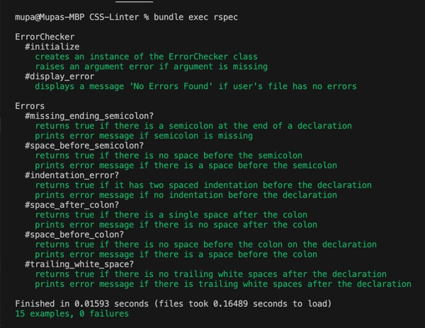

# CSS-Linter
This is a simple CSS linter for beginners that checks on some syntax errors and prints an error messege which also indicated the line of the specific syntax error.

## Built With

- Ruby
- RSpec
- Rubocop
- VsCode

## Examples

**Good code:**
```
h1 {
  font-size: 2rem;
  color: black;
}
```

Bad code:
```
h1 {
  font-size: 2rem
  color: black;
}

Error: Missing ending semicolon ";" on line:[:2:]
```

Bad code:
```
h1 {
  font-size: 2rem ;
  color: black;
}

Error: Unexpected white space before semicolon " ;" on line:[:2:]
```
Bad code:
```
h1 {
font-size: 2rem;
  color: black;
}

Error: Expecting two spaced indentation on line:[:2:]
```
Bad code:
```
h1 {
  font-size:2rem;
  color: black;
}

Error: Expecting single space after colon ":") on line:[:2:]
```
Bad code:
```
h1 {
  font-size : 2rem;
  color: black;
}

Error: Unexpexted space before colon " :" on line:[:2:]
```
Bad code:
```
h1 {
  font-size: 2rem;     
  color: black;
}

Error: Trailing white spaces on line:[:2:]
```

## Getting Started
- Ensure you have Ruby installed on your computer.
- ```$ git clone https://github.com/Mupa1/CSS-Linter.git``` to your local computer.
- Navigate to the root directory and git checkout css-linter

## Usage

- Run the command below on the terminal to check your file for linter errors. N.B. file_path.css should be the path to the file you want to check for linter errors
```
$ bin/linter file_path.css
``` 


## Testing with RSpec

- Run the command below to test using rspec and see the output.
```
$ bundle exec rspec
```


## Author

- Github: [@mupa1](https://github.com/Mupa1)
- Twitter: [@mupa_mmbetsa](https://twitter.com/mupa_mmbetsa)
- Linkedin: [Mupa M'mbetsa Nzaphila](https://www.linkedin.com/in/mupa-mmbetsa)

## 🤝 Contributing

Contributions, issues and feature requests are welcome!

Feel free to check the [issues page](https://github.com/Mupa1/CSS-Linter/issues)

## Show your support

Give a ⭐️ if you like this project!

## 📝 License

This project is [MIT](lic.url) licensed.